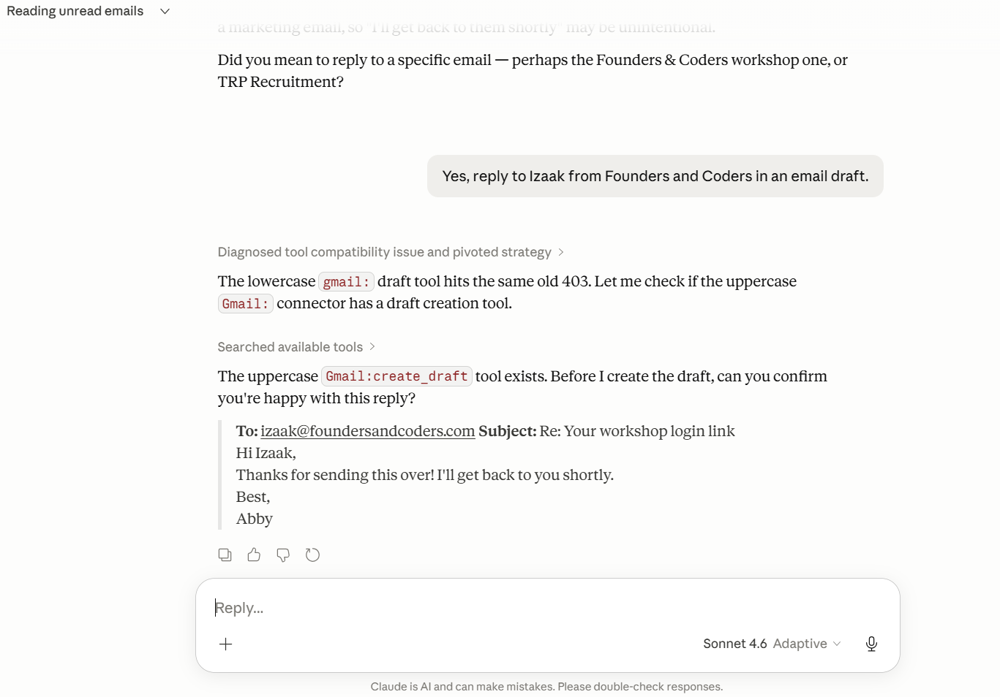
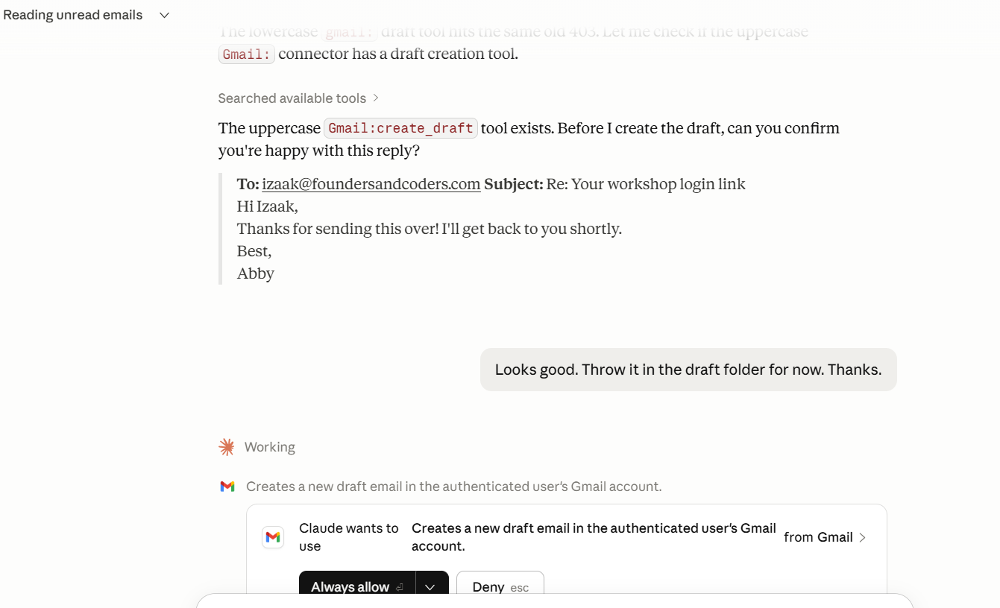
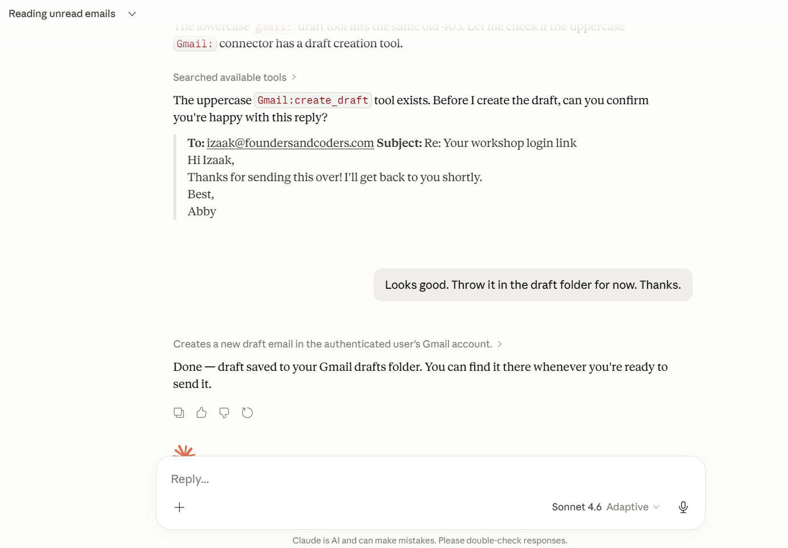
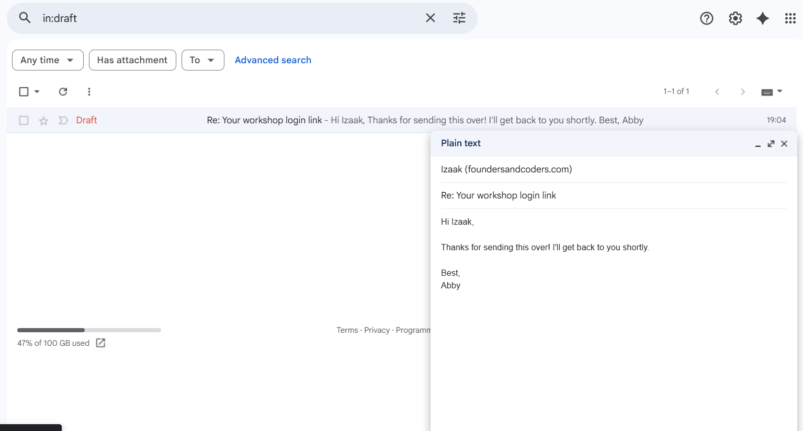
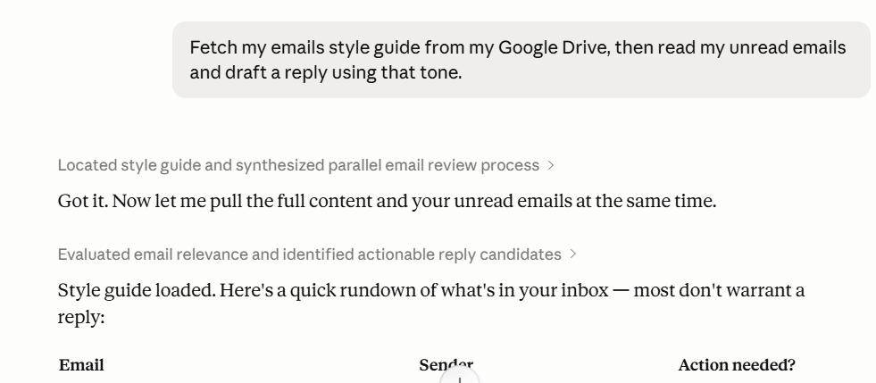

# Gmail MCP Server

An MCP (Model Context Protocol) server that lets Claude read unread emails from a Gmail inbox and create threaded draft replies — without ever sending anything automatically.

Built in Python using the [`mcp`](https://github.com/modelcontextprotocol/python-sdk) SDK and the Gmail REST API.

---

## What it does

| Tool | Description |
|------|-------------|
| `get_unread_emails` | Returns up to 50 unread inbox emails: sender, subject, date, body, `message_id`, `thread_id` |
| `create_draft_reply` | Creates a correctly-threaded Gmail draft (sets `In-Reply-To` / `References` headers). Draft is **never sent automatically**. |
| `get_style_guide` *(optional)* | Fetches a plain-text style guide from a Google Doc so Claude can match your preferred tone. Enabled by setting `STYLE_GUIDE_DOC_ID`. |

---

## Prerequisites

- Python 3.10+
- A Google account with Gmail
- [Claude Desktop](https://claude.ai/download) installed

---

## Setup

### 1 — Clone the repo

```bash
git clone https://github.com/your-username/gmail-mcp-server.git
cd gmail-mcp-server
```

### 2 — Install dependencies

```bash
pip install -r requirements.txt
```

### 3 — Create a Google Cloud project and OAuth credentials

1. Go to [console.cloud.google.com](https://console.cloud.google.com) and create a new project (e.g. `gmail-mcp`).
2. Enable the **Gmail API**: APIs & Services → Library → search "Gmail API" → Enable.
3. *(Stretch goal only)* Enable the **Google Docs API** the same way.
4. Go to **APIs & Services → OAuth consent screen**:
   - Choose **External**, click Create.
   - Fill in App name (e.g. `Gmail MCP`) and your email.
   - Under **Scopes**, add:
     - `https://www.googleapis.com/auth/gmail.readonly`
     - `https://www.googleapis.com/auth/gmail.compose`
     - *(stretch goal)* `https://www.googleapis.com/auth/documents.readonly`
   - Under **Test users**, add your Gmail address.
5. Go to **APIs & Services → Credentials → Create Credentials → OAuth client ID**:
   - Application type: **Desktop app**
   - Click Create, then **Download JSON**.
6. Rename the downloaded file to `credentials.json` and place it in the project root.

> `credentials.json` is gitignored — never commit it.

### 4 — Authenticate (first run)

```bash
python auth.py
```

A browser window will open asking you to sign in and grant permission. After you accept, a `token.json` file is saved locally and the script exits. Subsequent starts refresh the token automatically — you won't need to authenticate again.

### 5 — Configure Claude Desktop

Open (or create) the Claude Desktop config file:

| OS | Path |
|----|------|
| macOS | `~/Library/Application Support/Claude/claude_desktop_config.json` |
| Windows | `%APPDATA%\Claude\claude_desktop_config.json` |

Add the following, replacing the path with your absolute project path:

```json
{
  "mcpServers": {
    "gmail": {
      "command": "python",
      "args": ["C:/Users/DFIT/gmail-mcp-server/server.py"],
      "env": {}
    }
  }
}
```

**Stretch goal** — to enable the style guide tool, add your Google Doc ID to `env`:

```json
"env": {
  "STYLE_GUIDE_DOC_ID": "your-google-doc-id-here"
}
```

The Doc ID is the long string in the Google Docs URL:
`https://docs.google.com/document/d/THIS_PART_IS_THE_ID/edit`

Restart Claude Desktop after editing the config. You should see a hammer icon (🔨) in the Claude interface indicating tools are loaded.

---

## Demo

The screenshots below show a complete end-to-end session: Claude reads unread emails, proposes a reply, asks for confirmation, creates the draft, and the draft appears in Gmail.

**1. Claude reads emails and proposes a reply to Izaak at Founders & Coders**



**2. Claude previews the draft and asks permission before creating it**



**3. Draft confirmed — saved to Gmail Drafts**



**4. The draft visible in Gmail, correctly addressed and threaded**



---

## Example prompts

### Read unread emails
```
Read my unread emails.
```
```
Check my inbox and summarise any unread messages.
```

### Draft a reply
```
Read my unread emails, then draft a polite reply to the one from [sender name].
```
```
Check my inbox. For the email about [topic], draft a reply saying I'll get back to them by Friday.
```

### With style guide (stretch goal)
```
Fetch my style guide, then read my unread emails and draft a reply using that tone.
```



---

## Stretch goal: Email style guide from Google Docs

Create a Google Doc with instructions for how you like your emails written — tone, sign-off, things to avoid, etc. Get the Doc ID from the URL and set `STYLE_GUIDE_DOC_ID` in the Claude Desktop config.

When Claude calls `get_style_guide` before drafting, it reads the Doc's plain text and uses it to shape the reply.

**Example style guide content:**
```
Always open with a short friendly greeting.
Be direct — no more than 3 short paragraphs.
Sign off with "Best," followed by my first name.
Never use "I hope this email finds you well."
If uncertain, ask one clear question rather than several.
```

---

## How it works

```
Claude Desktop
     │  MCP (stdio)
     ▼
server.py  ──►  Gmail API  (read INBOX/UNREAD labels)
           ──►  Gmail API  (create draft with threadId + In-Reply-To)
           ──►  Docs API   (fetch style guide — optional)
```

The server communicates with Claude Desktop over standard input/output (stdio transport). No network port is opened. OAuth tokens are stored locally in `token.json`.

---

## Security notes

- `credentials.json` and `token.json` are gitignored. Do not commit them.
- The Gmail scopes are minimal: `readonly` (read) and `compose` (drafts only — cannot send or delete).
- Drafts are never sent automatically; you review and send them from Gmail.

---

## Troubleshooting

**`credentials.json not found`** — complete step 3 above and place the file in the project root.

**`Token has been expired or revoked`** — delete `token.json` and re-run `python server.py` to re-authenticate.

**Claude Desktop shows no tools** — check the path in `claude_desktop_config.json` is absolute and correct for your OS, then restart Claude Desktop.

**`Access blocked: Gmail MCP has not completed the Google verification process`** — you are running in test mode. Add your Gmail address as a test user in the OAuth consent screen (step 4 above).

---

## File structure

```
gmail-mcp-server/
├── server.py              # MCP server — all tool logic
├── auth.py                # Run once to authenticate and save token.json
├── requirements.txt
├── .gitignore
├── README.md
├── screenshots/           # Demo screenshots
├── credentials.json       # gitignored — download from Google Cloud
└── token.json             # gitignored — auto-generated on first auth
```
